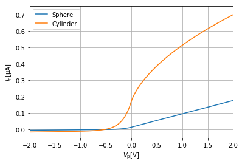

Langmuir
========

.. image:: https://travis-ci.com/langmuirproject/langmuir.svg?branch=master
    :target: https://travis-ci.com/langmuirproject/langmuir

.. image:: https://coveralls.io/repos/github/sigvaldm/langmuir/badge.svg?branch=master
    :target: https://coveralls.io/github/sigvaldm/langmuir?branch=master

.. image:: https://img.shields.io/pypi/pyversions/langmuir.svg
    :target: https://pypi.org/project/langmuir

Programmatically accessible current-voltage characteristics for ideal and non-ideal Langmuir probes

Installation
------------
Install from PyPI using ``pip`` (preferred method)::

    pip install langmuir

Or download the GitHub repository https://github.com/langmuirproject/langmuir.git and run::

    python setup.py install

Usage of OML Functions
----------------------

To compute the current collected for a sweep of voltages by a 25mm long cylindrical probe with radius 0.255mm in a plasma consisting of oxygen ions and electrons with density 1e11 and temperature of 1000K::

    >>> from langmuir import *
    >>> import numpy as np

    >>> n = 1e11
    >>> T = 1000
    >>> r = 0.255e-3
    >>> l = 25e-3

    >>> plasma = []
    >>> plasma.append(Species('electron' , n=n, T=T))
    >>> plasma.append(Species(amu=16, Z=1, n=n, T=T))

    >>> Vs = np.linspace(-10, 10, 100)
    >>> Is = OML_current(Cylinder(r, l), plasma, Vs)

Usage of Tables
---------------

The tables for attracted-species current for finite-radius probes in an isothermal Maxwellian plasma given by Laframboise is implemented. E.g. to get the normalized current for a spherical probe of 1 Debye length and a normalized potential of 25::

    >> from langmuir import *
    >> R = 1
    >> eV_kT = 25

    >> f = lafr_attr_current('Sphere')
    >> I = f(R, eV_kT)
    >> print("{:.3f}".format(I))
    21.895

The function linearly interpolates between values given in Laframboise's tables.
The argument ``kind`` can be used to change to quadratic interpolation.
To get the current in Ampére's you must find the normalizing current::

    >> n=1e11
    >> T=1e3

    >> I0 = lafr_norm_current('Sphere', R, n, T)
    >> I = I0*f(R, eV_kT)
    >> print("{:.1f}mA".format(I*1e3))
    -216.5mA

Likewise for cylindrical probes. The current is then in Ampère's per meter so
you must multiply by the probe length::

    >> l = 25e-3
    >> f = lafr_attr_current('Cylinder')
    >> I0 = lafr_norm_current('Cylinder', R, n, T)
    >> I = I0*l*f(R, eV_kT)
    >> print("{:.1f}uA".format(I*1e6))
    -711.0uA

Basic Usage
-----------

Function Overview
-----------------

Example: Plotting IV-characteristic
----------------------------------------------

.. code:: ipython3

    %matplotlib inline
    
    from langmuir import *
    import matplotlib.pyplot as plt
    
    n  = 1e11 # Plasma number density
    Te = 2000 # Electron temperature
    Ti = 1200 # Ion temperature 
    
    # Create electron and ion species with number density and temperatures as specified above
    electrons = Species('electron', n=n, T=Te)
    ions = Species('proton', n=n, T=Ti)
    species = [electrons, ions] 
    
    # Create the geometry for a spherical probe with radius 1mm
    sphere = Sphere(r=1e-3)
    # Create the geometry for a cylindrical probe with radius 1mm and length 25mm
    cylinder = Cylinder(r=1e-3, l=25e-3)
    
    # Create an array of bias voltages between -2.1V to 2.1V
    Vs = np.linspace(-2.1, 2.1, 200)
    
    fig = plt.figure(figsize=(6, 4))
    ax = fig.add_subplot(111)
    
    # Obtain the current predicted by OML theory
    I_sp = OML_current(sphere, species, Vs, normalize=False)  # For the spherical probe
    I_cp = OML_current(cylinder, species, Vs, normalize=False)# For the cylindrical probe
    
    # The currents are multiplied by 1e6 to display the results in micro Ampere.
    ax.plot(Vs, -I_sp*1e6, label='Sphere')  
    ax.plot(Vs, -I_cp*1e6, label='Cylinder')
    
    ax.set_xlim([-2., 2.])
    ax.set_xlabel(r'$V_{\mathrm{p}} [\mathrm{V}]$')
    ax.set_ylabel(r'$I_{\mathrm{p}} [\mathrm{\mu A}]$')
    ax.grid(True)
    ax.legend()
    plt.show()

Example: Finding unknown voltage
--------------------------------
