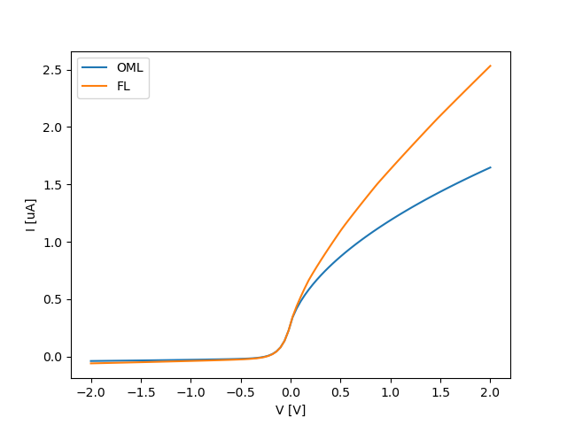

Langmuir
========

.. image:: https://travis-ci.com/langmuirproject/langmuir.svg?branch=master
    :target: https://travis-ci.com/langmuirproject/langmuir

.. image:: https://coveralls.io/repos/github/langmuirproject/langmuir/badge.svg?branch=master
    :target: https://coveralls.io/github/langmuirproject/langmuir?branch=master

.. image:: https://img.shields.io/pypi/pyversions/langmuir.svg
    :target: https://pypi.org/project/langmuir

.. image:: https://zenodo.org/badge/149759145.svg
    :target: https://zenodo.org/badge/latestdoi/149759145

.. image:: https://readthedocs.org/projects/langmuir/badge/?version=latest
    :target: https://langmuir.readthedocs.io/en/latest/?badge=latest
    :alt: Documentation Status

Programmatically accessible current-voltage characteristics for ideal and non-ideal Langmuir probes. See documentation on ReadTheDocs_.

.. _ReadTheDocs: http://langmuir.readthedocs.io

Installation
------------
Install from PyPI using ``pip`` (preferred method)::

    pip install langmuir

Or download the GitHub repository https://github.com/langmuirproject/langmuir.git and run::

    python setup.py install

Getting Started
---------------
The Langmuir library contains a collection of functions that compute the current collected by a conductor immersed in a plasma according to various models (characteristics). As an example, consider a 25-mm long cylindrical probe. Below is a comparison of the predicted current according to OML theory and the *finite-length* (FL) model which accounts for end effects. From characteristics it is in turn possible to infer plasma parameters using Langmuir probes. See full documentation on ReadTheDocs_.

