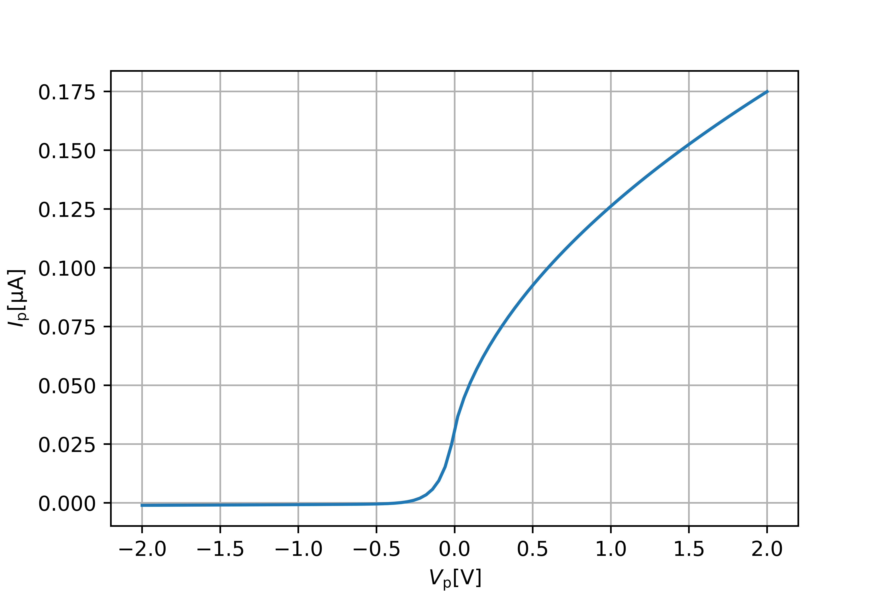

Langmuir
========

.. image:: https://travis-ci.com/langmuirproject/langmuir.svg?branch=master
    :target: https://travis-ci.com/langmuirproject/langmuir

.. image:: https://coveralls.io/repos/github/langmuirproject/langmuir/badge.svg?branch=master
    :target: https://coveralls.io/github/langmuirproject/langmuir?branch=master

.. image:: https://img.shields.io/pypi/pyversions/langmuir.svg
    :target: https://pypi.org/project/langmuir

Programmatically accessible current-voltage characteristics for ideal and non-ideal Langmuir probes.

Installation
------------
Install from PyPI using ``pip`` (preferred method)::

    pip install langmuir

Or download the GitHub repository https://github.com/langmuirproject/langmuir.git and run::

    python setup.py install

Getting Started
---------------
The Langmuir library contains a collection of functions that compute the current collected by a Langmuir probe according to various theories and models. These functions take as arguments the probe geometry, for instance ``Cylinder``, and a plasma, where a plasma may consist of one or more ``Species``.

As an example, consider a 25mm long cylindrical probe with radius 0.255mm. The plasma consists of electrons and singly charged oxygen ions, both with a density of 1e11 and a temperature of 1000K. The current-voltage charactersitic according to OML theory is easily computed and plotted::

    >>> from langmuir import *
    >>> import numpy as np
    >>> import matplotlib.pyplot as plt

    >>> plasma = []
    >>> plasma.append(Species('electron' , n=1e11, T=1000))
    >>> plasma.append(Species(amu=16, Z=1, n=1e11, T=1000))

    >>> Vs = np.linspace(-2, 2, 100)
    >>> Is = OML_current(Cylinder(r=0.255e-3, l=25e-3), plasma, Vs)

    >>> fig = plt.figure()
    >>> ax = fig.add_subplot(111)

    >>> ax.plot(Vs, -Is*1e6)
    >>> ax.set_xlabel(r'$V_{\mathrm{p}} [\mathrm{V}]$')
    >>> ax.set_ylabel(r'$I_{\mathrm{p}} [\mathrm{\mu A}]$')
    >>> ax.grid(True)
    >>> plt.show()

Notice that the characteristic includes all regions (ion saturation, electron retardation and electron saturation), and do not rely on approximations to the OML theory requiring the voltage to be within a certain range. What's more, it's easy to take into account for instance finite-radius effects, by replacing ``OML_current()`` with ``finite_radius_current()``.

Specifying a species
--------------------
A species is specified using a range of keyword arguments upon initialization of a ``Species`` object.
At the very least, you must specify the density and the temperature (or thermal speed)::

    >>> Species(n=1e11, T=1000)

Since nothing more is specified, this represents Maxwellian-distributed electrons. The full set of keywords is as follows:

+---------------------------+-----------+--------------------------+------------------+
| Quantity                  | Keyword   | Units                    | Default value    |
+===========================+===========+==========================+==================+
| Charge                    | ``q``     | Coulombs                 | electron         |
|                           +-----------+--------------------------+ charge           |
|                           | ``Z``     | elementary charges       |                  |
+---------------------------+-----------+--------------------------+------------------+
| Mass                      | ``m``     | kilograms                | electron         |
|                           +-----------+--------------------------+ mass             |
|                           | ``amu``   | atomic mass units        |                  |
+---------------------------+-----------+--------------------------+------------------+
| Density                   | ``n``     | partices per cubic meter |                  |
+---------------------------+-----------+--------------------------+------------------+
| Temperature/thermal speed | ``T``     | Kelvin                   |                  |
|                           +-----------+--------------------------+                  |
|                           | ``eV``    | electron-volts           |                  |
|                           +-----------+--------------------------+                  |
|                           | ``vth``   | meters per second        |                  |
+---------------------------+-----------+--------------------------+------------------+
| Spectral index kappa      | ``kappa`` | dimensionless            | ``float('inf')`` |
+---------------------------+-----------+--------------------------+------------------+
| Spectral index alpha      | ``alpha`` | dimensionless            | ``0``            |
+---------------------------+-----------+--------------------------+------------------+

The Langmuir library supports the general Kappa-Cairns velocity distribution, but defaults to Maxwellian, which is a special case of the Kappa-Cairns distribution.Kappa, Cairns or Kappa-Cairns distributed particles are obtained by specifying ``kappa``, ``alpha`` or both, respectively.

The charge and mass can also be specified using one of three self-descriptive flag:

- ``'electron'``
- ``'positron'``
- ``'proton'``

This must come before the keyword arguments, for instance::

    >>> Species('proton', n=1e11, eV=0.1)

Computing fundamental plasma parameters
---------------------------------------
The Langmuir library is also convenient to use for quick computations of fundamental plasma parameters, since ``Species`` computes these upon initialization. For instance, to get the electron Debye length of a plasma with a certain density and temperature::

    >>> Species(n=1e11, eV=0.1).debye
    0.007433942027347403

The following member variables and methods are accessible in ``Species``:

+-----------------+---------------------------------+
| Member          | Description                     |
+=================+=================================+
| ``debye``       | The Debye length                |
+-----------------+---------------------------------+
| ``omega_p``     | The angular plasma frequency    |
+-----------------+---------------------------------+
| ``freq_p``      | The linear plasma frequency     |
+-----------------+---------------------------------+
| ``period_p``    | The plasma period               |
+-----------------+---------------------------------+
| ``omega_c(B)``  | The angular cyclotron frequency |
+-----------------+---------------------------------+
| ``freq_c(B)``   | The linear cyclotron frequency  |
+-----------------+---------------------------------+
| ``period_c(B)`` | The cyclotron period            |
+-----------------+---------------------------------+
| ``larmor(B)``   | The larmor radius               |
+-----------------+---------------------------------+

The latter four members are methods which take the magnitude of the magnetic flux density as an argument. In addition, every valid keyword argument is also a valid member variable::

    >>> Species(n=1e11, T=1000).eV
    0.08617330337217212

Finally, the total Debye length of a plasma consisting of multiple species can be obtained using the ``debye()`` function::

    >>> plasma = []
    >>> plasma.append(Species('electron' , n=1e11, T=1000))
    >>> plasma.append(Species(amu=16, Z=1, n=1e11, T=1000))
    >>> debye(plasma)
    0.004879671013271479

Specifying the geometry
-----------------------
Langmuir supports two probe geometries, with self-descriptive names and the following signatures:

- ``Sphere(r)``
- ``Cylinder(r, l)``

``r`` and ``l`` representes the radius and length, respectively, of the geometry.

Models for collected current
----------------------------
Langmuir comes with several models for the collected current. Each model is represented by a function which takes a ``geometry`` and a ``species`` argument. The ``geometry`` is one of the above probe geometries, and the ``species`` parameters is either a single ``Species`` object or a list of such if it is desirable to take into account the effect of all species in a plasma. Most models also depend on the potential of the probe with respect to the background plasma. The potential can either be specified in volts using th ``V`` argument, or in terms of normalized voltage e*V/(k*T) using the ``eta`` argument. If these are Numpy arrays, the output will be a Numpy array of collected currents. The ``normalization`` argument can be set to ``'th'``, ``'thmax'``, ``'oml'`` to return currents normalized by the thermal current, Maxwellian thermal current, or OML current, respectively, rather than Ampére. Below is a description of all models:

- ``OML_current(geometry, species, V=None, eta=None, normalization=None)``
  Current collected by a probe according to the Orbital Motion Limited (OML)
  theory. The model assumes a probe of infinitely small radius compared to
  the Debye length, and for a cylindrical probe, that it is infinitely long.
  Probes with radii up to 0.2 Debye lengths (for spherical probes) or 1.0
  Debye lengths (for cylindrical probes) are very well approximated by this
  theory, although the literature is diverse as to how long cylindrical probes
  must be for this theory to be a good approximation.

- ``finite_radius_current(geometry, species, V=None, eta=None, table='laframboise-darian-marholm', normalization=None)``
  A current model taking into account the effects of finite radius by
  interpolating between tabulated normalized currents. The model only
  accounts for the attracted-species currents (for which eta<0). It does
  not extrapolate, but returns ``nan`` when the input parameters are outside
  the domain of the model. This happens when the normalized potential for any
  given species is less than -25, when kappa is less than 4, when alpha is
  more than 0.2 or when the radius is more than 10 or sometimes all the way
  up towards 100 (as the distribution approaches Maxwellian). Normally finite
  radius effects are negligible for radii less than 0.2 Debye lengths (spheres)
  or 1.0 Debye lengths (cylinders).

- ``finite_length_current(geometry, species, V=None, eta=None, normalization=None)``
  The Marholm-Marchand model for finite-length probes. Works for normalized
  voltages up to 100.

- ``finite_length_current_density(geometry, species, V=None, eta=None, z=None, zeta=None, normalization=None)``
  The current per unit length according to the Marholm-Marchand model for
  finite-length probes. Works for normalized voltages up to 100. ``z`` is
  position on the probe, and ``zeta`` is position normalized by the Debye
  length.

- ``thermal_current(geometry, species, normalization=None)``
  Returns the thermal current for the given species and geometry. The
  thermal current is the current the species contributes to a probe at zero
  potential with respect to the background plasma due to random thermal
  movements of particles.

- ``normalization_current(geometry, species)``
  Returns the normalization current for the given species and geometry.
  The normalization current is the current the species would have contributed
  to a probe at zero potential with respect to the background plasma due to
  random thermal movements of particles, if the species had been Maxwellian.

As an example, the following snippet computes the normalized electron current of a probe of 3 Debye lengths radius and normalized voltage of -10::

    >>> sp  = Species(n=1e11, T=1000)
    >>> geo = Cylinder(r=3*sp.debye, l=1)
    >>> I = finite_radius_current(geo, sp, eta=-10, normalization='th')

Notice that setting ``l==1`` means you get the current per unit length.

Inverse problems
----------------
Sometimes the collected current of one or more probes is known and one would like to solve for one or more other parameters. The Langmuir library do not address this analytically in part due to the vast number of such inverse problems, and in part due to some characteristics not being invertible (for instance those who are of tabulated values). However, it is in principle possible to apply numerical methods of root solving, least squares, etc. along with the models in Langmuir.

Consider a cylindrical probe with known dimensions and a positive but unknown voltage collecting a current of -0.4uA in a Maxwellian plasma with known density and temperature. What is the voltage? We shall neglect the current due to ions, and define a residual function. This residual is the difference between the current collected by a probe at a given potential, and the actual collected current, and it is used by a least squares algorithm to compute the voltage::

    >>> from langmuir import *
    >>> from scipy.optimize import leastsq

    >>> sp = Species(n=1e11, T=1000)
    >>> geo = Cylinder(1e-3, 25e-3)
    >>> I = -0.4e-6

    >>> def residual(V):
    >>>     return finite_radius_current(geo, sp, V) - I

    >>> x, c = leastsq(residual, 0)
    >>> print(x[0])
    0.6265540484991013

The reader may verify that this voltage indeed results in the correct current. Notice also that we were in fact able to invert the model ``finite_radius_current``, which consists of tabulated values.

A slightly more interesting inversion problem, is that of determining the ionospheric density from four cylindrical Langmuir probes with known bias voltages with respect to a spacecraft, but an unknown floating potential ``V0`` of the spacecraft with respect to the plasma. We shall assume the bias voltages to be 2.5, 4.0, 5.5 and 7.0 volts. In the below example, we first construct the currents for such probes by assuming a floating potential and a set of plasma parameters, but we do not use this knowledge in the inversion. We do, however, make an initial guess ``x0`` which we believe are somewhat close to the answer::

    >>> from langmuir import *
    >>> from scipy.optimize import leastsq

    >>> geo = Cylinder(1e-3, 25e-3)
    >>> V0 = -0.5
    >>> V = np.array([2.5, 4.0, 5.5, 7.0])
    >>> I = OML_current(geo, Species(n=120e10, T=1000), V+V0)

    >>> def residual(x):
    >>>     n, V0 = x
    >>>     return OML_current(geo, Species(n=n, T=1500), V+V0) - I

    >>> x0 = [10e10, -0.3]
    >>> x, c = leastsq(residual, x0)
    >>> n, V0 = x

    >>> print(n)
    1199899818493.931

    >>> print(V0)
    -0.5417515655165968

The method correctly determined the density to be 120e10. However, the floating potential ``V0`` is off by almost ten percent. The reason is that the temperature is considered unknown, and assumed to be 1500K when solving the problem, while it is actually 1000K. Since we have four measurements (four equations) and only two unknowns, it is tempting to also include the temperature as an unknown parameter and try to solve for it. However, if this is done the least squares algorithm will fail miserably. The reason is that the set of equations arising for the attracted-species current of cylindrical probes are singular and cannot be solved for even analytically. Fortunately, both the temperature and floating potential can be eliminated from the equation when analytically solving for the density, and similarly it also works to obtain the density from the least squares algorithm. Since the floating potential and temperature represent a coupled unknown which cannot be solved for, an error in assuming one is reflected as an error in the other.

This demonstrates the usefulness as well as challenges and subtleties of solving inverse Langmuir problems.
