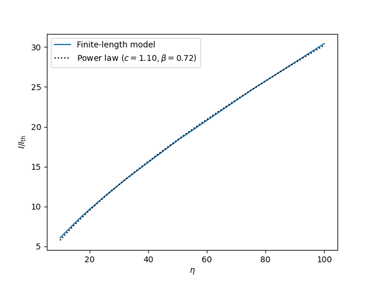

Fitting beta for a finite-length probe
--------------------------------------
For large voltages, :math:`\eta=qV/kT\gg 1`, the normalized current collected from the attracted species according to the OML theory may be written as power law:

.. math::

    \frac{I}{I_\mathrm{th}} \approx c\eta^\beta

where :math:`\beta` is 0, 0.5 or 1 for a plane, cylinder or sphere, respectively. It is customary to use this same expression for probes of finite length as well, but with :math:`\beta` varying between 0.5 and 1. This example demonstrates how to use a standard curve fitting algorithm to find :math:`\beta` for a cylindrical probe of ten Debye lengths:

.. literalinclude:: ../../demo/beta.py

In the code we start by evaluating the charactersitic at 100 points along :math:`\eta\in[10,100)`. Note that we keep the normalized voltage always above 10 such that the large voltage approximation is satisfied. We then define the function we want to fit the characteristic to, ``power_law``, with the input as the first argument, followed by an arbitrary number of fitting coefficients (in our case two). The SciPy function ``curve_fit`` makes a best fit of these coefficients, returned in the tuple ``popt``. With these coefficients, the fit (dotted line) is in excellent agreement with the actual characteristic (solid line), and :math:`\beta=0.72`.
