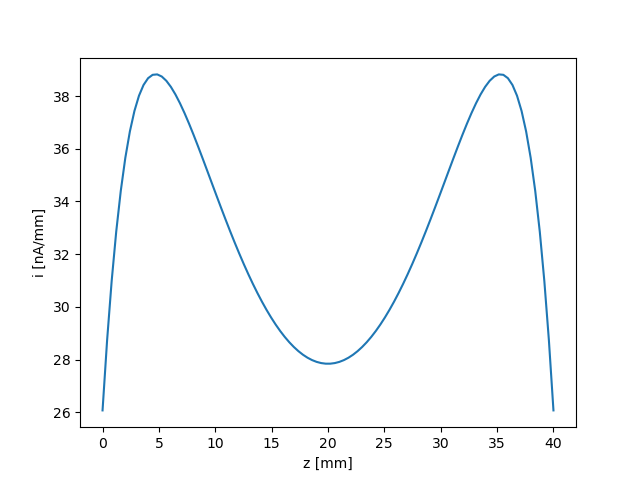
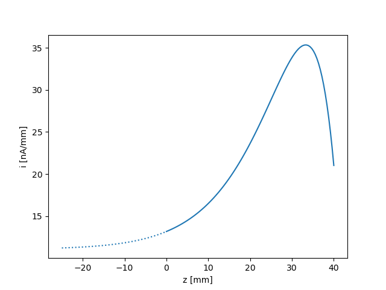

Finite length models
--------------------

The two finite-length models are based on theoretical scaling laws and numerical simulations, and accounts for edge effects on cylindrical probes. They assume a collisionless, non-magnetized and non-drifting Maxwellian plasmas, as well as a small probe radius. However, they can account for probes of arbitrary length, all the way down to below the Debye length (at which point the probes behave as if they were spherical). The models are valid for normalized voltages up to 100. See [Marholm]_ for a full description.

Current per unit length
~~~~~~~~~~~~~~~~~~~~~~~
The first model describes not the total collected current, but the current :math:`i(z)` per unit length, as a function of the position :math:`z` on the probe, and has the following signature::

    finite_length_current_density(geometry, species, V=None, eta=None, z=None, zeta=None, normalization=None)

This model has an additional argument ``z``, which is the position on the probe, starting at zero. Alternatively, one may use the normalized position ``zeta``, defined as :math:`\zeta=z/\lambda_D`. Below is an example for a 40-mm probe with both ends free:

.. literalinclude:: ../../demo/profile.py

The end effects from the two ends are quite severe, and they even overlap. In reality, however, one end of the probe must necessarily be attached to something, and this is usually a guard. Ideally, a guard is an infinite cylindrical extension of the probe at the same voltage as the probe, but electrically insulated from it, such that current collected by the guard is not included in the measurements. This is supposed to remove end effects from this end of the probe. It is possible to enable ideal guards by setting either ``lguard`` (left guard) or ``rguard`` (right guard) in ``Cylinder`` to ``True`` or ``float('inf')``. In the modified example below, we include a guard to the left of the probe, and we also plot the current collected by the nearest part of the guard:

.. literalinclude:: ../../demo/profile2.py

If finite values are used for ``lguard`` or ``rguard``, the end of the guard pointing away from the probe will assume end effects similar to that of a free cylindrical end, and these end effects may extend into the probe if the guard is short. In reality a guard will often be mounted on a spacecraft or some arbitrary body, which will lead to a different end effect than that of a free end. Due to the arbitraryness of this end effect, it cannot be predicted by the finite-length model. For this reason, and because the model is believed to be more accurate for large probe plus guard lengths (see [Marholm]_), it is advisable to specify ideal guards in most cases. For the same reasons, it is also advisable that instruments be designed with long guards (long probes are in fact less important, since their non-ideal effects can be predicted).

Total collected current
~~~~~~~~~~~~~~~~~~~~~~~
The second model describes the total collected current, and is merely the integral of the current per unit length. Its signature is as follows::

    finite_length_current(geometry, species, V=None, eta=None, normalization=None, interpolate='I')

See example of use in :doc:`getting_started`.

.. _behind-the-curtains:

Behind the curtains
~~~~~~~~~~~~~~~~~~~
This section describes implementation details beyond what is mentioned in [Marholm]_.
The current per unit length in the finite-length model (``finite_length_current_density``) is given by the following expression [Marholm]_:

.. math::

    i(z) = i_\mathrm{OML}\, g(\zeta; \lambda, \eta)

where :math:`i_\mathrm{OML}` is the current per unit length according to the OML theory, and

.. math::

    \zeta = \frac{z}{\lambda_D} ,\quad
    \lambda = \frac{l}{\lambda_D} ,\quad
    \eta = -\frac{qV}{kT}

are the non-dimensional groups. :math:`z` is the position on the probe, which spans from 0 to :math:`l`. Moreover,

.. math::

    g(\zeta) = C( 1 + h(\zeta) + h(\lambda-\zeta) ) \, \\
    h(\zeta) = A( \zeta - \delta + \alpha^{-1}) \exp(-\alpha\zeta)

where :math:`A`, :math:`C`, :math:`\alpha` and :math:`\delta` are coefficients that are known for fixed pairs :math:`(\lambda,\eta)` on a regular grid.

For probes with guards, the total normalized length is taken to be :math:`\lambda=\lambda_l+\lambda_p+\lambda_r`, where :math:`\lambda_l` and :math:`\lambda_r` are the normalized lengths of the left and right guards, respectively, whereas :math:`\lambda_p` is the normalized length of the actual probe. The end effects still have the same shape, but are (partially) absorbed by the guards. However, in Langmuir the origin is shifted, such that the ``zeta`` parameter is actually :math:`\zeta_p=\zeta-\lambda_l`. With this shift, the probe strecthes from :math:`\zeta_p=0` to :math:`\zeta_p=\lambda_p`, and the guards extend beyond this range on either side. The :math:`g`-function may be re-written as a function of :math:`\zeta_p`:

.. math::

    g(\zeta_p) = C( 1 + h(\lambda_l+\zeta_p) + h(\lambda_p+\lambda_r-\zeta_p) )

The total current collected by the probe (``finite_length_current``) is obtained by integrating :math:`i(z)` over the probe, excluding the guards,

.. math::

    I &= i_\mathrm{OML}\lambda_DG \\
    G &= \int_0^{\lambda_p} g(\zeta_p)\,\mathrm{d}\zeta_p =
    C( \lambda_p + H(\lambda_p+\lambda_l) + H(\lambda_p+\lambda_r)
                 - H(\lambda_l)           - H(\lambda_r) ) \\
    H(\zeta) &= A\frac{\alpha(\delta-\zeta)-2}{\alpha^2}\exp(-\alpha\zeta) 

The shift of origin is not only convenient, but eliminates the need to subtract :math:`\lambda_l` from :math:`\lambda_l+\lambda_p`, which could lead to issues of numerical accuracy when :math:`\lambda_l` is large, or even tends to infinity. The above expressions, on the other hand, have no such differences, and behave gracefully as the guard lengths increases to infinity.

For parameters :math:`(\lambda,\eta)` *not* on the regular grid in parameter space, interpolation is necessary. One alternative is to linearly interpolate the coefficients :math:`A`, :math:`C`, :math:`\alpha` and :math:`\delta`. However, as described in [Marholm]_ this may not behave well for short probe plus guard lengths. For the total collected currents it is also possible to calculate :math:`I` for the four nearest parameters :math:`(\lambda,\eta)` on the grid, and interpolate :math:`I` linearly. This gives a smoother result, since :math:`I` then varies linearly with :math:`(\lambda,\eta)`. This is now the default behaviour, but :math:`I` may still be derived from interpolated coefficients by setting ``interpolate='g'`` in ``finite_length_current``.
