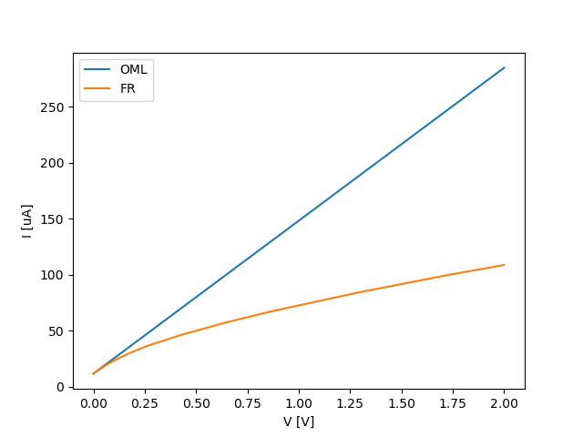

Finite radius models
--------------------

Finite radius models relax the restriction on the OML theory that the radius should be small, and may be accessed through the following function::

    finite_radius_current(geometry, species, V=None, eta=None, table='laframboise-darian-marholm', normalization=None)

Example of use:

.. literalinclude:: ../../demo/finite_radius.py

The model is built from two sets of tabulated numerical results, which can be found in [Laframboise]_ and [Darian]_. The former is more accurate but covers only Maxwellian plasmas, whereas the latter covers the more general Kappa-Cairns distributions. By default interpolation between tabulated values will use the most accurate values. The model is valid for :math:`0\leq\eta\leq 25`, :math:`\kappa\leq 4` and :math:`\alpha>0.2`. Probe radii extends up to 10 Debye lengths, or even 100 Debye lengths as the distribution approaches Maxwellian.
