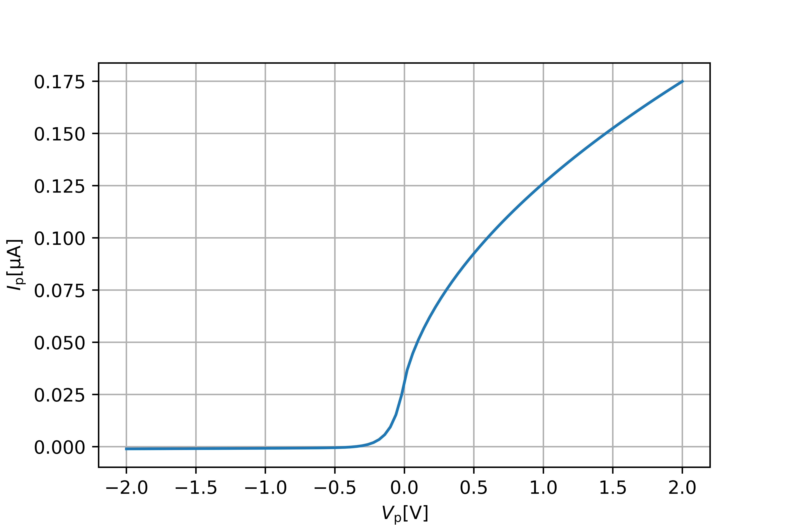

Getting Started
===============
The Langmuir library contains a collection of functions that compute the current collected by a Langmuir probe according to various theories and models. These functions take as arguments the probe geometry, for instance ``Cylinder``, and a plasma, where a plasma may consist of one or more ``Species``.

As an example, consider a 25mm long cylindrical probe with radius 0.255mm. The plasma consists of electrons and singly charged oxygen ions, both with a density of 1e11 and a temperature of 1000K. The current-voltage charactersitic according to OML theory is easily computed and plotted::

    >>> from langmuir import *
    >>> import numpy as np
    >>> import matplotlib.pyplot as plt

    >>> plasma = []
    >>> plasma.append(Species('electron' , n=1e11, T=1000))
    >>> plasma.append(Species(amu=16, Z=1, n=1e11, T=1000))

    >>> Vs = np.linspace(-2, 2, 100)
    >>> Is = OML_current(Cylinder(r=0.255e-3, l=25e-3), plasma, Vs)

    >>> fig = plt.figure()
    >>> ax = fig.add_subplot(111)

    >>> ax.plot(Vs, -Is*1e6)
    >>> ax.set_xlabel(r'$V_{\mathrm{p}} [\mathrm{V}]$')
    >>> ax.set_ylabel(r'$I_{\mathrm{p}} [\mathrm{\mu A}]$')
    >>> ax.grid(True)
    >>> plt.show()

Notice that the characteristic includes all regions (ion saturation, electron retardation and electron saturation), and do not rely on approximations to the OML theory requiring the voltage to be within a certain range. What's more, it's easy to take into account for instance finite-radius effects, by replacing ``OML_current()`` with ``finite_radius_current()``.

Another example is processing 4-Needle Langmuir Probe (4-NLP) measurements using the Jacobsen-Bekkeng method to get density. If the probe biases are 2, 3, 4, and 5V, and the N measurements samples is contained in an Nx4 array ``I``, the densities can be found as follows::

    >>> n = jacobsen_density(Cylinder(r=0.255e-3, l=25e-3), [2,3,4,5], I)
