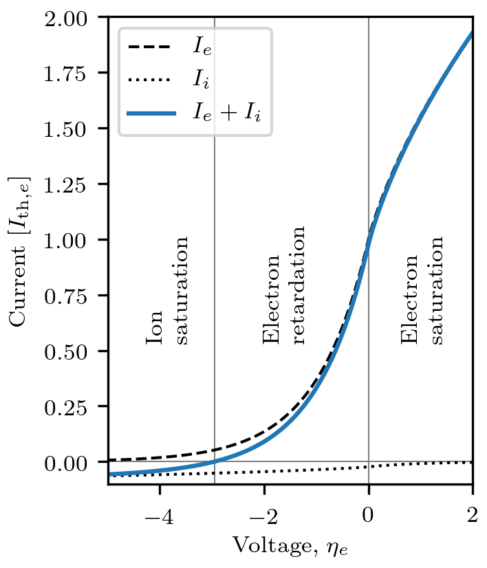
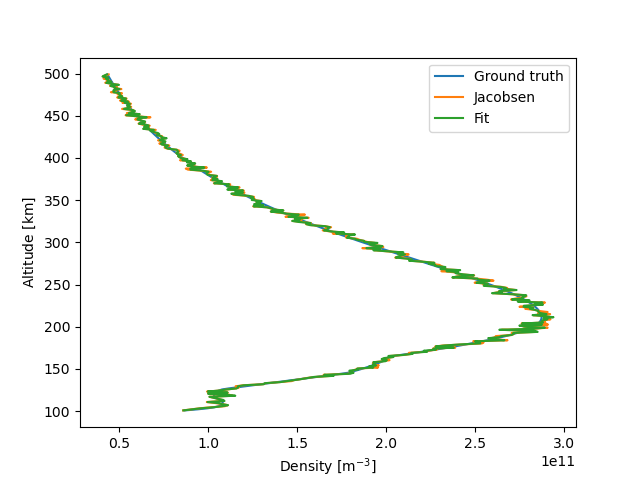
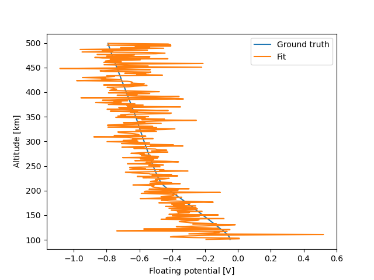
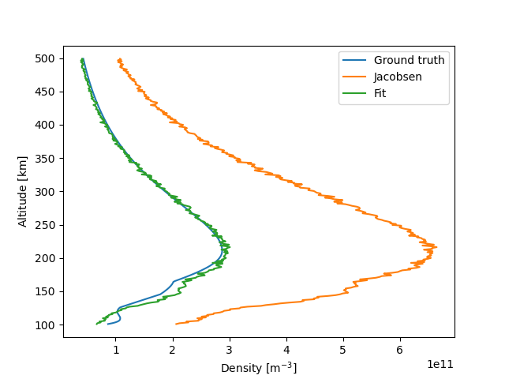
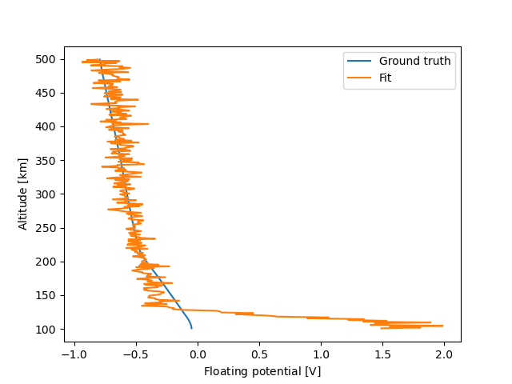
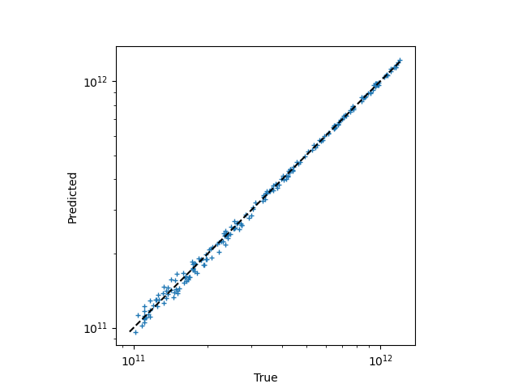
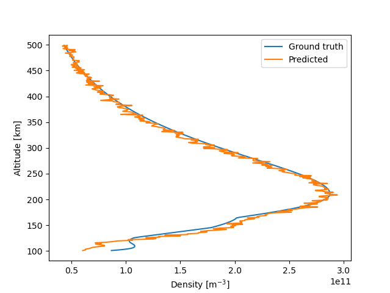

Inferring plasma parameters from measurements
---------------------------------------------
The purpose of Langmuir probes is to measure plasma parameters, such as the electron and ion densities, and the electron temperature. The traditional techniques rely on OML theory, which predicts that the characteristic behaves differently in different regions of the probe voltage. For voltages between the floating potential and the background plasma potential (here taken to be zero), for instance, the ion current can be neglected and the OML theory then predicts a slope :math:`\mathrm{d}(\ln I) /\mathrm{d}V` depending only on the electron temperature, as well as some physical constants. Doing a voltage sweep across this region therefore allows the determination of the electron temperature. Further on, in the electron (ion) saturation region, the ions (electrons) can be neglected, and the analytical expressions of the remaining part allows determination of the electron (ion) density, once the electron temperature is known [Marholm2]_, [Bekkeng]_, [MottSmith]_, [Bittencourt]_.

Another technique is that of Jacobsen and Bekkeng for the multineedle Langmuir probe (m-NLP) instrument [Jacobsen]_. The m-NLP instrument consists of at least two (typically four) cylindrical Langmuir probes biased at different fixed positive voltages with respect to a spacecraft. The OML theory predicts that the slope :math:`\mathrm{d}I^2/\mathrm{d}V` depends only on the electron density, except for known physical constants. The m-NLP instrument thus allows inferring the electron density without sweeping the voltage, which gives the m-NLP  instrument faster sampling times and thus higher spatial resolution while spaceborn than swept Langmuir probes. A fast implementation of this density inference technique is readily available in Langmuir. Given an :math:`N\times 4` array ``I``, where each row corresponds to the currents measured at some time instant by probes biased at, say, 2, 3, 4, and 5 volts with respect to some common reference voltage, the densities can be inferred as follows::

    n = jacobsen_density(Cylinder(r=0.255e-3, l=25e-3), [2,3,4,5], I)

The main problem with these approaches is that they rely upon specific analytic expressions for the characteristic, which may not hold for non-ideal cases (finite length, finite radius, collisional or non-Maxwellian plasmas). Another problem is in identifying the different regions. In spaceborn Langmuir probes, for instance, the probe voltage is only known with respect to the spacecraft, and not with respect to the background plasma.

A general formulation
~~~~~~~~~~~~~~~~~~~~~
In relation to the Langmuir software we take a more general point of view [Marholm2]_. Consider that a set of currents :math:`\{\hat I_p\}_{p=1}^N` have been measured in a plasma. The currents may for instance be the currents corresponding to different voltages of a swept Langmuir probe, or it may be the currents collected by different probes, such as in the m-NLP instrument. For the sake of generality, we allow each measurement to obey a different characteristic function, which we denote :math:`I_p(V_p; \mathbf P)`. :math:`V_p` is the probe voltage at which the current was measured, and :math:`\mathbf P` is a vector of other parameters that the characteristics depend upon, such as electron temperature and density. The probe voltage is often not known with respect to the background plasma, but instead with respect to a common reference voltage :math:`V_0`. For spaceborn instruments this is the spacecraft floating potential. With this, we may write :math:`V_p=V_0+V_{0p}`, and the measurements form the following system of equations:

.. math::

    \hat I_p = I_p (V_0 + V_{0p}; \mathbf P),\quad p=1,...,N

This set of equations may be solved for the unknowns :math:`(V_0,\mathbf P)` by any suitable numerical method (insofar as it is well-posed), and there is a wide range of free software available depending on how this system is to be solved. However, it requires programmatic access to the characteristics :math:`I_p(V_p; \mathbf P)`. Computing the currents for given physical parameters may be considered the *forward problem*, and it is a prerequisite for solving the *inverse problem*, namely inferring physical parameters from measured currents. Langmuir focuses on the forward problem. In the following, however, we give a few examples of attacking the inverse problem.

.. Fitting a power law
.. ~~~~~~~~~~~~~~~~~~~

Synthetic data
~~~~~~~~~~~~~~
For experimentation, the following function can be used to generate a test set of synthetic currents::

    generate_synthetic_data(geometry,
                            V,
                            model=finite_length_current,
                            V0=None,
                            alt_range=(100,500),
                            noise=1e-5)

The currents are synthesized assuming densities from IRI [IRI]_ and temperatures from MSIS [MSIS]_ for 45 degrees latitude, 0 degrees longitude, and altitudes within the range given by ``alt_range`` at local noon. The advantage of synthetic data is that since the ground truth is known, it can be used to measure the accuracy of the inversion. Beware, however, that ``generate_synthetic_data`` necessarily must use some model to generate the currents (given by ``model``), and the net accuracy of the final inferred parameters will depend both on the accuracy of the inversion *and* of the forward model for the problem at hand.

``generate_synthetic_data`` will also add noise proportional to the square root of the signal strength and the factor ``noise`` for a representative signal-to-noise ratio [Ikezi]_, as well as generate a synthetic floating potential. Alternatively the floating potential can be preset by the argument ``V0``. For a given ``geometry`` and array of bias voltages ``V``, the function returns a dictionary with the following arrays:

- ``alt``: Altitude of the data samples [km]
- ``I``: Synthetic current measurements [A], one column for each bias voltage
- ``V0``: Ground truth, floating potential [V]
- ``Te``: Ground truth, electron temperature [K]
- ``Ti``: Ground truth, ion temperature [K]
- ``ne``: Ground truth, electron density [1/m^3]
- ``nO+``: Ground truth, density of oxygen ions [1/m^3]
- ``nO2+``: Ground truth, density of doubly charged oxygen ions [1/m^3]
- ``nNO+``: Ground truth, density of nitrosonium ions [1/m^3]
- ``nH+``: Ground truth, density of hydrogen ions [1/m^3]

Inversion by least-squares curve fitting
~~~~~~~~~~~~~~~~~~~~~~~~~~~~~~~~~~~~~~~~
In this section we consider how to infer electron density and floating potential from current measurements by an iterative non-linear least squares curve fitting algorithm. Least-squares fitting works by minimizing a sum of squared residuals :math:`r_p`,

.. math::

    R=\sum_p r_p^2

with respect to the fitting coefficients which in our case is :math:`(n_e, V_0)`. The residuals, we take as

.. math::
   
    r_p = (I_p (V_0 + V_{0p}; \mathbf P) - \hat I_p)

such that a perfect solution yields :math:`R=0`.

We shall assume a 4-NLP instrument with bias voltages :math:`V_{0p}` of 2, 3, 4 and 5 volts with respect to the unknown floating potential :math:`V_0`. There will then be four residuals per time sample, and in order to use SciPy's `least_squares` function we need to define a function `residual` returning a vector of these four residuals when given an approximation of the coefficients :math:`x=(n_e, V_0)` as its first argument.

To begin with, it is advisibale to verify the method on a simpler case. We therefore assume that OML theory is a perfect representation of reality, and use it to generate synthetic ground truth data along with ``generate_synthetic_data``. We then do the least-squares fit of the synthesized currents to the OML characteristic (:math:`I_p` is given by ``OML_current``), and verify that we are able to make predictions close to the ground truth. The code reads as follows:

.. literalinclude:: ../../demo/inverse_lsq.py

The loop carries out the fit over each sample, and to increase our chance of success and possibly reduce the number of iterations required, we try to give it an initial guess ``x0`` that is as close as possible to the true value as possible. For the first sample this is a pre-set value, and for subsequent samples we use the previous solution.

Because numerical algorithms often work best for numbers close to unity, we also scale the coefficients :math:`(n_e, V_0)`. This is conveniently handled by ``least_squares`` itself, which accepts an argument ``x_scale`` with numbers of typical magnitude. The residuals are in the order of microampére's and also needs to be scaled. However, although ``least_squares`` has an argument ``f_scale`` for the residuals, it is not always in use. We therefore multiply the residuals by ``1e6`` ourselves.

The residual function may also accept arguments that are not part of the optimization, in our case the four currents stored in the vector ``I`` and the electron temperature ``T``. These are passed through to ``residual`` using the ``args`` argument of ``least_squares``. Although the electron temperature is technically an unknown parameter (an input to the forward model), it is hard to infer it because the characteristic only depends very weakly on it (see [Hoang]_, [Barjatya]_, [Marholm2]_). We therefore specify it manually. This could just be a representative number (2000K in our case), or it could be a number from another instrument or model. For our example with synthetic data it is also possible to use the ground truth directly, by replacing the line ``T = 2000`` with ``T = data['Te'][i]``. Execution results in the following plots:

The density agrees well with both the ground truth, as well as densities inferred with the Jacobsen-Bekkeng method. Close inspection, however, reveals a small discrepancy between our method and the Jacobsen-Bekkeng method. This is due to the fact that the system is overdetermined (inferring 2 parameters from 4 measurements), and the Jacobsen-Bekkeng method minimizes a squared residual in :math:`\mathrm{d}I^2/\mathrm{d}V`, whereas our method minimizes a squared residual in :math:`I` itself. Removing two of the bias voltages lead to perfect agreement. The method captures a trend in the floating potential but cannot make accurate predictions of it.

Now that the technique is established, we can proceed by assuming that the finite-length model is a perfect representation of reality, and fitting the currents to the finite-length characteristic. This is simply a matter of substituting the following lines::

    model_truth = finite_length_current
    model_pred = finite_length_current

During data synthesis we will receive warnings about the normalized voltage :math:`eV/kT` exceeding the maximum of 100 in the finite-length model. This happens for the lower altitudes, when the temperature :math:`T` is low. It will not prevent execution, however, but it is important to be aware of, since it means the model must extrapolate, which is less accurate than interpolation. The resulting inference is plotted as before:

As is to be expected, the inferred density is close to the ground truth. For finite-length effects, the inferred density is not entirely independent of the specified temperature ``T``, and this causes some error. The dependence is weak enough, however, that the error is not severe. The accuracy is also degraded for lower altitudes due to the aforementioned extrapolation. The floating potential is not very accurate, but then again, this cannot be expected when it was not accurate for the simpler case. Finally, it is interesting to compare with the Jacobsen-Bekkeng method, since this is indicative of the error caused by neglecting end effects.

Inversion by machine learning
~~~~~~~~~~~~~~~~~~~~~~~~~~~~~
Another way to solve the inverse problem is by machine learning, or more
specifically, by regression. This was first described in [Chalaturnyk]_ and
[Guthrie]_, and we shall carry out a similar (though not entirely identical)
procedure here. We consider a plasma parameter (here: the electron density
:math:`n_e`) to be approximated by some function :math:`f` of measured
currents:

.. math::
   n_e = f(\hat I_1, \hat I_2, ..., \hat I_N)

The function represents, in our case, a machine learning network, and has a
number of coefficients that will be determined by fitting (training) it to
synthetic data with known densities :math:`n_e`. Once the network is trained,
it can be used to predict densities :math:`\hat n_e` from actual measurements.
The procedure can be split in three parts, as seen in the example code:

.. literalinclude:: ../../demo/inverse_rbf.py

First, :math:`N` synthetic data points are generated by randomly selecting
densities (:math:`n` s), temperatures (:math:`T` s) and floating potentials
(:math:`V_0` s) from appropriate ranges, and computing corresponding currents
using Langmuir. Beware that if the ranges do not properly cover the values
expected in the actual data, the network may have to extrapolate, which usually
result in inaccurate predictions.

Second, we train a regression network. We use a *radial basis function* (RBF)
network from the localreg_ library for closer proximity to the above-mentioned
research, although one could also use TensorFlow or other alternatives.
Remember, however, that from a machine learning point-of-view, this is a small
problem that is not well served by *deep* neural networks with many degrees of
freedom. Regardless of choice, it is important to test the network's
performance (quantitatively!) on data which was not used in training. We use
80\% of the synthetic data for training, and set aside the remaining part for
testing. The testing reveal that the root mean square (RMS) of the relative
density error is about 3--4% (depending on the seed of the random number
generator). The correlation plot also show good agreement between prediction
and ground truth:

.. _localreg: https://github.com/sigvaldm/localreg

Third and finally, once the network has been tested, it can be used to make
predictions on real data (or in our case data generated with
``generate_synthetic_data()``):

For real applications it is advisable to do the last step in a separate file,
using a pre-trained network that is stored as a file for reuse.

When a parameter (e.g., the density) may span multiple orders of magnitudes,
often only the most significant figures are of interest. :math:`1.00\cdot
10^{12}\,\mathrm{m^{-3}}` and :math:`0.99\cdot 10^{12}\,\mathrm{m^{-3}}` are in
practice indistinguishable, whereas there's a huge difference between
:math:`1\cdot 10^{10}\,\mathrm{m^{-3}}` and :math:`2\cdot
10^{10}\,\mathrm{m^{-3}}`, although the difference between the two pairs of
numbers are the same. In such cases it makes sense to minimize the *relative error*

.. math::
   \frac{\hat n_e-n_e}{n_e},

rather than the absolute error :math:`\hat n_e-n_e`. Although the range of
densities in our example is not that large, we choose to train the network
using relative errors. We also distribute the training densities
logarithmically, since otherwise, few data points would have low orders of
magnitude, which would lead to an under-prioritization of the accuracy of of
these lower density magnitudes.
